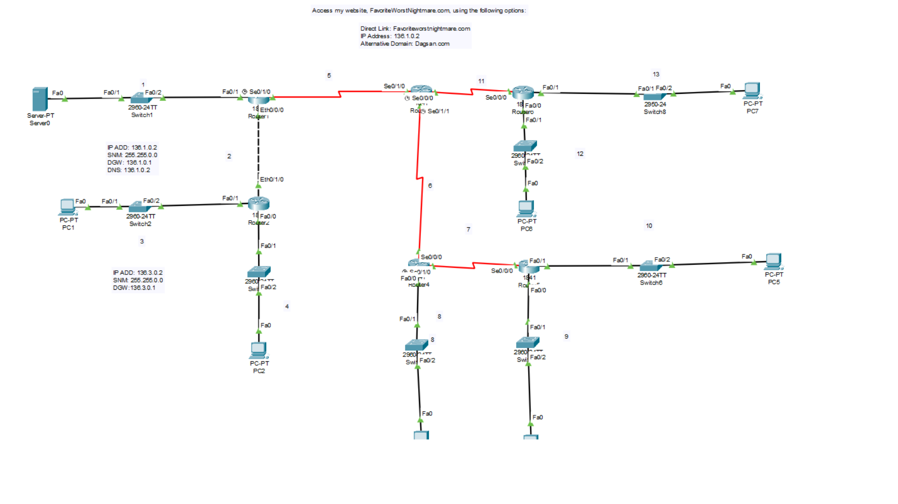
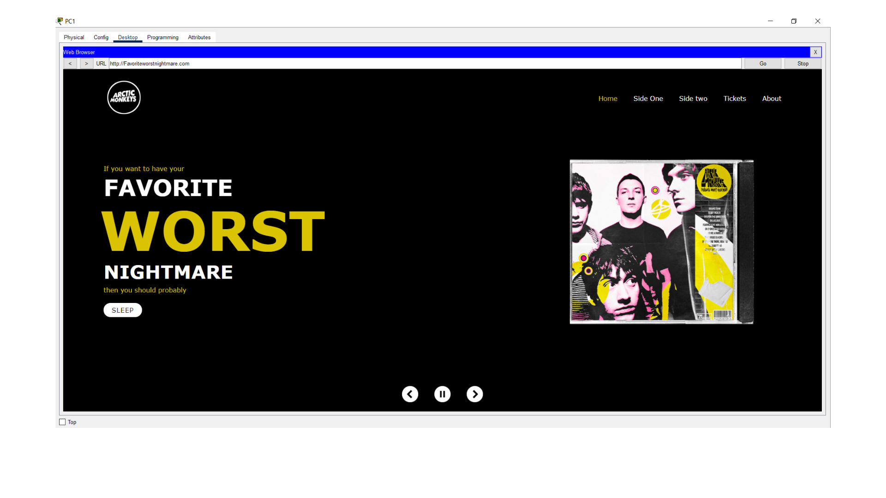

# Cisco Packet Tracer & Web Hosting 

This repository contains files and activities related to **Cisco Packet Tracer networking exercises** and **web hosting fundamentals**, combining networking concepts with simple front-end development.

These project demonstrate how a website can be hosted and accessed inside Cisco Packet Tracer’s simulated network environment.

---

## Important Note on Image Organization

Cisco Packet Tracer **does not support folder structures** for uploaded website files.  
Because of this:

- All images must be placed **in the same folder** as the main HTML file (e.g., `index.html`).  
- Normally, in real-world web development, images would be stored in organized folders like:

--- 
 # Tech Stack

     

--- 

 # Preview

